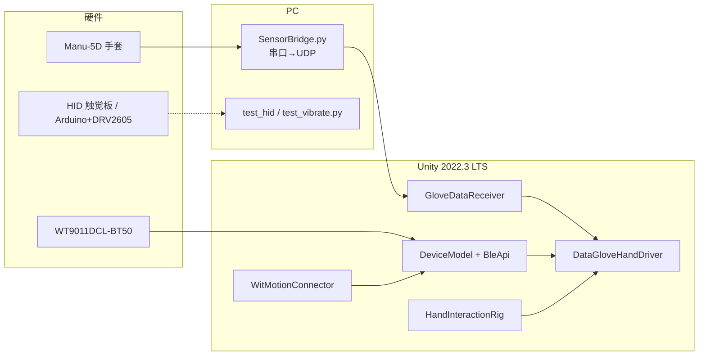

# 基于数据手套的虚拟手交互与触觉反馈系统

> 本科毕业设计：用 **Elastreme Sense Manu-5D** 数据手套采集五指弯曲，经 **Python 串口桥** 以 UDP 送入 Unity，驱动 **Rigged Hand** 骨骼；用 **WitMotion WT9011DCL-BT50**（BLE）提供手腕姿态与相对位移估计；场景内为 **非 XR** 的 Trigger / Rigidbody 交互；触觉侧为 **Arduino + DRV2605 + LRA**，仓库根目录提供 **HID** 测试脚本验证双路马达板。

阅读本文后，你应能回答：**数据从哪来、Unity 里谁在处理、没硬件怎么调试、蓝牙与 Python 各负责什么**。

---

## 1. 项目做什么

| 能力 | 实现要点 |
|------|-----------|
| 手指跟随 | 手套 → 串口 → `SensorBridge.py` → UDP → `GloveDataReceiver` → `DataGloveHandDriver` 旋转 5 指骨骼 |
| 手腕姿态与位移 | WT9011 BLE → `WitMotionConnector` + `DeviceModel` 解析 → `DataGloveHandDriver` 做欧拉角显示旋转与**近场、短距离**的相对位移增强（重力低通估计 + 启动标定 + 冻结窗口 + 弹簧回中；可选平面模式与缓慢回中） |
| 抓取与碰触 | `HandInteractionRig` 在指尖挂 Trigger；`FingerTipRelay` 转发事件；`TouchableObject` 提供高亮与 `UnityEvent`（可接触觉串口等） |
| 场景与资源 | `RiggedHandPrefabSetup` 一键从 FBX 生成左手 Prefab 并布置场景；`HandSceneSetup` 让主摄像机跟随手部包围盒 |
| 无手套调试 | `GloveDataReceiver` 的键盘模拟（1–5 单指、Space 握拳）；`SceneViewHandKeyboardBridge` 在 Scene 视图用 WASD 等微调手部位移（运行中） |

本项目 **未** 在 `Packages/manifest.json` 中引入 **XR Interaction Toolkit**；交互基于自定义 Trigger / 捏合阈值与物理刚体。

---

## 2. 系统架构与数据流



**三条主通道简述：**

1. **手套**：蓝牙虚拟串口（上位机或系统枚举为 COMx）→ `SensorBridge.py` 读行、去分号 → UDP `127.0.0.1:5005`（默认）→ `GloveDataReceiver` 解析 11 个逗号分隔数值中的前 5 个为弯曲（0–1800 对应 0°–180°），归一化后交给 `DataGloveHandDriver`。运行前请关闭占用串口的 **OneCOM** 等上位机，否则会与 Python 抢端口。
2. **姿态传感器**：`WitMotionConnector` 使用 `Assets/Scripts/Bluetooth/BleApi`（WinRT 原生 `BleWinrtDll.dll`）持续轮询扫描，匹配名称含 **WT** 的设备并连接；数据经 `DeviceModel` 线程解析，供 `DataGloveHandDriver` 做手腕旋转与受限相对位移估计。当前位移链路**不以远距离连续平移为目标**，而是服务**近场交互**：在 **慢速低通估计重力 + 启动静止标定 + 转动冻结窗口 + 弹簧回中** 的基础上，可通过 **`usePlanarPositionOnly`** 自动压掉 `positionAxisWeight` 中最不稳定的一轴（仅两轴参与位移），并用 **`positionRecenteringSpeed`** 在非静止状态下极慢地将偏移拉回零，减轻长期累计漂移。项目中另有 `BlueScanner` / `BlueConnector` 通用扫描连接栈，当前 WT 流程以 `WitMotionConnector` 为主（避免短轮询漏设备）。
3. **触觉**：游戏逻辑层可通过 `TouchableObject` 的事件扩展串口/USB；根目录 Python 脚本用于 **VID `0x674E` / PID `0x000A`** 的 HID 板直连测试（见下文）。

---

## 3. 运行环境与依赖

### 3.1 硬件（与代码假设一致）

- Elastreme Sense **Manu-5D** 数据手套（输出分号结尾的 ASCII 行，波特率默认 **115200**）
- WitMotion **WT9011DCL-BT50**（BLE，广播名通常含 **WT**）
- Windows PC + Unity 编辑器
- 可选：HID 双路触觉板（上述 VID/PID）；或 Arduino + DRV2605 + LRA（固件/协议以你实际上位机为准）

### 3.2 软件版本

- **Unity**：`2022.3.62f3` LTS（见 `ProjectSettings/ProjectVersion.txt`）
- **Python 3.x**：`pyserial`（`SensorBridge.py`）、`hid`（[`hidapi`](https://pypi.org/project/hidapi/)，用于 `test_hid.py` / `test_vibrate.py`）
- **Arduino IDE**（若使用 Arduino 触觉方案）

### 3.3 Unity 包说明

`Packages/manifest.json` 为 Unity 默认特性集（UGUI、Timeline、Visual Scripting 等），**不含** XR Interaction Toolkit。虚拟手依赖 **Physics**、**Animation 骨骼** 与自定义脚本。

---

## 4. 仓库目录结构（与仓库一致）

```
My project/
├── README.md
├── test_hid.py              # HID 单发振动测试（命令 0xAA）
├── test_vibrate.py          # 遍历 DRV2605 效果 ID（命令 0xBB）
├── Assets/
│   ├── Editor/
│   │   ├── RiggedHandPrefabSetup.cs   # 菜单 Tools → Setup Rigged Hand Prefab
│   │   └── SceneViewHandKeyboardBridge.cs  # 运行时在 Scene 视图用键盘微调手部位置
│   ├── Materials/
│   │   └── HandSkin.mat
│   ├── Models/
│   │   └── Rigged Hand.fbx
│   ├── Prefabs/Hands/
│   │   └── LeftHand.prefab
│   ├── Scenes/
│   │   └── SampleScene.unity
│   └── Scripts/
│       ├── SensorBridge.py
│       ├── GloveDataReceiver.cs
│       ├── DataGloveHandDriver.cs
│       ├── WitMotionConnector.cs
│       ├── HandInteractionRig.cs
│       ├── TouchableObject.cs
│       ├── FingerTipRelay.cs      # 指尖 Trigger → HandInteractionRig
│       ├── HandSceneSetup.cs      # 主摄像机对准手部
│       ├── Bluetooth/
│       │   ├── BlueConnector.cs   # GATT 连接与收包线程
│       │   ├── BlueScanner.cs     # 通用 BLE 扫描（可与 WitMotionConnector 并存注意资源）
│       │   └── BleApi/
│       │       ├── BleApi.cs      # WinRT BLE 封装
│       │       └── BleWinrtDll.dll
│       └── Device/
│           ├── DeviceModel.cs     # 单设备解析、线程、OnKeyUpdate
│           └── DevicesManager.cs  # 多设备字典与当前设备
├── Packages/
│   └── manifest.json
└── ProjectSettings/
```

---

## 5. 核心脚本职责速查

| 组件 / 脚本 | 职责 |
|-------------|------|
| `SensorBridge.py` | 读手套串口一行 → 去掉末尾 `;` → UDP 发送整行字符串 |
| `GloveDataReceiver.cs` | UDP 或键盘模拟 → 五指 0–1 弯曲数组；通道顺序可 `reverseFingerOrder` |
| `DataGloveHandDriver.cs` | 根据弯曲旋转骨骼；根据 `DeviceModel` 数据做手腕旋转、近场重力估计式相对位移（可选平面模式、缓慢回中）、转动冻结与调试键盘叠加 |
| `WitMotionConnector.cs` | WT 专用：长时扫描、`connectable=False` 时仍可选连接、连接 `DeviceModel` |
| `BleApi` + `BlueConnector` + `DeviceModel` | Windows BLE 底层、连接与字节流解析 |
| `HandInteractionRig.cs` | 指尖 Trigger、捏取/握拳阈值、吸附刚体；需根节点 **Kinematic Rigidbody** |
| `FingerTipRelay.cs` | 挂在指尖球上，把 `OnTriggerEnter/Exit` 交给 `HandInteractionRig` |
| `TouchableObject.cs` | 可触摸物体：高亮、`allowPinchGrab`、触摸/抓取 `UnityEvent` |
| `HandSceneSetup.cs` | 挂主摄像机，`LateUpdate` 对准 `LeftHand` 渲染包围盒 |
| `RiggedHandPrefabSetup.cs` | 编辑器一键生成左手 Prefab、布置场景、默认键盘手套模式 |
| `SceneViewHandKeyboardBridge.cs` | 编辑模式下 Scene 视图焦点时 WASD/QE 等控制位移（配合 `DataGloveHandDriver` 键盘位姿开关） |

**手套数据格式**（`GloveDataReceiver` 注释）：一行如 `1504,900,100,0,0,0,0,0,0,0,0` — 前 5 个数为 CH1–CH5 弯曲（小指→拇指），脚本可反转为拇指在前再驱动骨骼。

---

## 6. 快速启动

### 6.1 首次打开工程

1. 用 **Unity Hub** 打开本文件夹，确认编辑器版本为 **2022.3.62f3**（或同 2022.3 系列，避免大版本差异）。
2. 若场景中没有配置好的左手：菜单栏 **Tools → Setup Rigged Hand Prefab**，会生成 `Assets/Prefabs/Hands/LeftHand.prefab` 并配置 `SampleScene`（详见脚本对话框说明）。
3. 打开 `Assets/Scenes/SampleScene.unity`。

### 6.2 仅键盘调试（无手套、无传感器）

1. 选中场景中带 `GloveDataReceiver` 的对象，勾选 **Use Keyboard Simulation**。
2. Play：**1–5** 控制五指弯曲，**Space** 握拳；在 **Scene** 视图聚焦时可用 **WASD / QE / PageUp-Down** 等微调位置（`SceneViewHandKeyboardBridge`）。
3. `DataGloveHandDriver` 中可单独开关手腕旋转/位置与键盘位置调试选项。

### 6.3 连接真实手套

1. 在 `Assets/Scripts/SensorBridge.py` 中设置 `SERIAL_PORT`、`BAUD_RATE`、`UDP_PORT`，与 `GloveDataReceiver` 的 **udpPort** 一致。
2. 终端执行：`python Assets/Scripts/SensorBridge.py`（或从你习惯的工作目录指向该文件）。
3. 在 Unity 中 **取消勾选** `GloveDataReceiver` 的 **Use Keyboard Simulation**。
4. Play，观察 Console 与手指动画。

### 6.4 连接 WitMotion 传感器

1. 场景中确保有 `WitMotionConnector`（一键 Setup 会添加）。
2. 打开 WT9011 电源，Windows 蓝牙正常；Play 后等待自动扫描/连接（可在 Inspector 调整 `autoScan`、`autoConnect`、`scanTimeout` 等）。
3. 若旋转轴反向或漂移，在 `DataGloveHandDriver` 中调节 **axisSign / axisRemap**、死区与平滑参数。位置侧优先服务**近场、短距离**交互：通过 **`wristMaxOffset`** 限制最大偏移；演示求稳可开启 **`usePlanarPositionOnly`**；若偏移长期“黏”在一边可调 **`positionRecenteringSpeed`**；若平移偏弱或转腕假位移仍大，再调 **positionAxisWeight**、**wristPositionGain**、**gravityEstimateFilterSpeed**、**positionFreezeDuration**、**wristPositionSpring** 与 **wristVelocityDamping**。

---

## 7. 根目录 Python：HID 触觉测试

需要先安装：`pip install hid`（Windows 上通常还需可用的 USB/HID 驱动，必要时管理员权限运行）。

| 脚本 | 作用 |
|------|------|
| `test_hid.py` | 打开 VID/PID，发送 **0xAA** 命令触发左右路“射击”类振动，可选读 64 字节回包 |
| `test_vibrate.py` | 循环发送 **0xBB** 命令，对左右路写入 DRV2605 波形编号（脚本内 `effects_to_test` 列表），每条约 2 秒 |

若 VID/PID 或报文格式与你的硬件不一致，请按实际固件修改脚本常量。

---

## 8. 常见问题（排障）

- **手套无数据**：检查 COM 号、是否被 OneCOM 等占用、波特率 115200、`SensorBridge.py` 与 Unity 端口一致、防火墙是否拦截本机 UDP。
- **BLE 搜不到 WT**：确认设备名广播含 WT、蓝牙已开、`scanTimeout` 足够；Windows 对 `connectable=False` 时可勾选 `WitMotionConnector` 的 **connectEvenIfNotConnectable**。
- **WT 位置漂移或转腕假位移明显**：先静止放置传感器约 1–2 秒完成启动标定；再调低 **gravityEstimateFilterSpeed** 防止真实平移被吸进重力估计，调高 **positionFreezeDuration / freezeVelocityDampingMultiplier** 抑制转腕扰动，必要时通过 **positionAxisWeight** 单独减弱最不稳定轴，或开启 **usePlanarPositionOnly** 只保留两轴。若希望偏移不要长期累计，可适当提高 **positionRecenteringSpeed**（仍属慢回中，不会替代弹簧与静止清速）。
- **抓不住物体**：确认 `TouchableObject` 带 **非 Trigger** 的 Collider + **Rigidbody**；`HandInteractionRig` 根节点有 **Kinematic Rigidbody**；调高 `grabAssistRadius` 或检查 `allowPinchGrab`。
- **手指穿模**：尝试开启 `HandInteractionRig` 的 **enablePhysicalTipCollision** 并调节物理球半径。

---

## 9. 维护建议

- 修改串口协议、UDP 格式、BLE UUID、WT 位置估计参数策略或抓取逻辑时，请同步更新 **第 2、5、6、8 节** 与相关脚本顶部注释。
- 新增场景、Prefab 或第三方插件时，在本 README 增加一行说明其角色，避免后续读者只在工程里“猜”。
