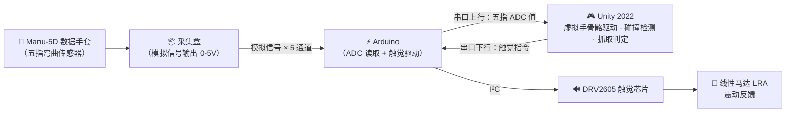

# 基于数据手套的虚拟手交互与触觉反馈系统

> 本科毕业设计 · 通过 Elastreme Sense Manu-5D 数据手套采集手指弯曲数据，驱动 Unity 虚拟手实时运动，并在抓取交互时通过 Arduino + DRV2605 触觉芯片产生线性马达震动反馈。

---

## 系统架构



> Arduino 作为中枢，同时承担传感器数据采集（ADC 读取 0-5V）和触觉反馈驱动（DRV2605 I²C 控制）。

---

## 核心文件一览

项目中你最需要关注的是以下 **4 个脚本**，它们各司其职、协同工作：

| 文件 | 一句话说明 | 角色 |
|------|-----------|------|
| `GloveDataReceiver.cs` | 从 Arduino 串口读取五指弯曲原始数据，归一化为 0~1 | **数据输入层** |
| `DataGloveHandDriver.cs` | 根据弯曲值旋转手部骨骼关节 | **骨骼驱动层** |
| `HandSceneSetup.cs` | 运行时自动计算网格位置并定位摄像机 | **场景管理层** |
| `RiggedHandPrefabSetup.cs` | 编辑器工具，一键生成 Prefab 并放入场景 | **编辑器工具** |

### 文件间协作流程

```
运行时数据流：

  Arduino 串口数据
       │
       ▼
  GloveDataReceiver          ← 后台线程读取串口，解析为 float[5]
       │
       │  FingerValues[0..4]（0=伸直, 1=完全弯曲）
       ▼
  DataGloveHandDriver        ← 每帧读取 FingerValues，旋转 15 个骨骼关节
       │
       │  直接操作 Transform.localRotation
       ▼
  SkinnedMeshRenderer         ← Unity 自动根据骨骼变换更新网格显示

  HandSceneSetup              ← 挂载在摄像机上，通过 Renderer.bounds
                                 计算手部网格实际位置，自动对准
```

```
编辑器配置流程（只需运行一次）：

  Tools → Setup Rigged Hand Prefab
       │
       ▼
  RiggedHandPrefabSetup       ← 从 FBX 生成 Prefab，放入场景
       │                         自动创建 GloveManager（含 GloveDataReceiver）
       │                         自动在主摄像机上添加 HandSceneSetup
       │                         自动连接 DataGloveHandDriver → GloveDataReceiver
       ▼
  场景就绪，按 Play 即可测试
```

---

## 硬件需求

| 硬件 | 说明 |
|------|------|
| Elastreme Sense Manu-5D | 无线数据手套，采集五根手指弯曲角度 |
| 采集盒 | Manu-5D 配套，内置模拟信号输出端口（0-5V） |
| Arduino（Uno / Nano） | 中枢：ADC 读取传感器 + I²C 驱动触觉芯片 |
| DRV2605 触觉驱动模块 | TI 触觉驱动芯片，通过 I²C 控制马达 |
| 线性马达（LRA） | 与 DRV2605 配合，产生震动触觉反馈 |
| PC（Windows 10/11） | 运行 Unity 编辑器 |

### Arduino 接线

| 采集盒通道 | Arduino 引脚 | 说明 |
|-----------|-------------|------|
| 通道 1（拇指） | A0 | analogRead 0-1023 |
| 通道 2（食指） | A1 | analogRead 0-1023 |
| 通道 3（中指） | A2 | analogRead 0-1023 |
| 通道 4（无名指） | A3 | analogRead 0-1023 |
| 通道 5（小指） | A6 或 A7 | A4/A5 被 I²C 占用 |
| DRV2605 SDA | A4 | I²C 数据线 |
| DRV2605 SCL | A5 | I²C 时钟线 |
| DRV2605 VCC | 3.3V | |
| DRV2605 GND | GND | |

---

## 软件需求

| 软件 | 版本 / 说明 |
|------|------------|
| Unity Editor | **2022.3.62f3** (LTS) |
| API 兼容级别 | **.NET Framework**（串口通信依赖 `System.IO.Ports`） |
| Arduino IDE | 1.8.x 或 2.x，用于烧录固件 |

> 本项目已移除所有 VR/XR 相关包（OpenXR、XR Interaction Toolkit 等），不依赖 VR 头显。

---

## 项目结构详解

```
My project/
├── Assets/
│   ├── Editor/                          # Unity 编辑器扩展（仅在编辑器中运行）
│   │   └── RiggedHandPrefabSetup.cs     #   一键生成手部 Prefab 的工具
│   │
│   ├── Materials/                       # 材质文件
│   │   └── HandSkin.mat                 #   手部皮肤材质（URP Lit, 肤色）
│   │
│   ├── Models/                          # 3D 模型
│   │   └── Rigged Hand.fbx             #   带骨骼的手部模型（Blender 导出）
│   │
│   ├── Prefabs/                         # Prefab 预制体
│   │   └── Hands/
│   │       └── LeftHand.prefab          #   左手预制体（由工具自动生成）
│   │
│   ├── Scenes/                          # 场景文件
│   │   └── SampleScene.unity            #   主演示场景
│   │
│   └── Scripts/                         # 运行时脚本（核心代码）
│       ├── GloveDataReceiver.cs         #   串口数据接收 + 键盘模拟
│       ├── DataGloveHandDriver.cs       #   骨骼自动绑定 + 旋转驱动
│       └── HandSceneSetup.cs            #   摄像机自动对准手部模型
│
├── Packages/
│   └── manifest.json                    # Unity 包依赖清单
│
└── ProjectSettings/                     # Unity 项目设置
    └── ProjectSettings.asset            #   API 兼容级别设为 .NET Framework
```

### 各文件详细说明

#### `Scripts/GloveDataReceiver.cs` — 数据输入层

- **挂载位置**：场景中的 `GloveManager` 对象
- **功能**：在后台线程通过 `System.IO.Ports.SerialPort` 持续读取 Arduino 串口数据
- **数据格式**：Arduino 发送 `"thumb,index,middle,ring,pinky\n"`（5 个 0-1023 的整数）
- **输出**：`FingerValues[5]` 数组，归一化为 0（伸直）~ 1（完全弯曲）
- **测试模式**：勾选 `useKeyboardSimulation` 后无需硬件，按 1-5 键模拟单指弯曲，Space 键握拳
- **关键配置**：串口号（默认 COM3）、波特率（默认 9600）、ADC 范围（0-1023）

#### `Scripts/DataGloveHandDriver.cs` — 骨骼驱动层

- **挂载位置**：`LeftHand` Prefab 的根对象上
- **依赖**：需要引用一个 `GloveDataReceiver`（通过 Inspector 的 `Glove Data` 字段）
- **启动流程**：`Start()` 时调用 `AutoFindBones()`，在子层级中按名称搜索 15 个骨骼 Transform
- **骨骼命名规则**：`{boneName}.{编号}{后缀}`，如 `thumb.01.L`、`finger_index.02.L`
- **运行时**：每帧从 `GloveDataReceiver.FingerValues` 读取弯曲值，计算各关节角度，通过 `Transform.localRotation` 旋转骨骼
- **角度分配**：近端关节分配更多角度（权重 0.40 / 0.35 / 0.25），模拟真实手指弯曲
- **可调参数**：每根手指的弯曲轴 `bendAxis`、最大角度 `maxBendAngle`、平滑速度 `smoothSpeed`

#### `Scripts/HandSceneSetup.cs` — 场景管理层

- **挂载位置**：由编辑器工具自动挂载到主摄像机上
- **核心改进**：通过计算所有 `Renderer` 的 `bounds` 包围盒来确定手部网格的实际世界坐标，不再硬编码摄像机位置
- **功能**：
  - `Start()` 时扫描 LeftHand 下所有 SkinnedMeshRenderer 的 bounds，计算出模型中心和大小
  - 确保 SkinnedMeshRenderer 在离屏时也更新（`updateWhenOffscreen = true`）
  - 隐藏地面等遮挡物
  - `LateUpdate()` 中每帧让摄像机跟踪手的位置（为将来手部移动做准备）
- **可调参数**：`viewDistanceMultiplier`（观察距离倍数）、`viewDirection`（观察方向向量）

#### `Editor/RiggedHandPrefabSetup.cs` — 编辑器工具

- **入口**：菜单栏 `Tools → Setup Rigged Hand Prefab`
- **流程**：
  1. 加载 `Assets/Models/Rigged Hand.fbx`
  2. 实例化 FBX，移除内嵌的 Blender 摄像机和灯光
  3. 应用皮肤材质 `HandSkin.mat`
  4. 添加 `DataGloveHandDriver` 组件，设置骨骼后缀为 `.L`
  5. 保存为 `LeftHand.prefab`
  6. 清理场景中的旧对象和 XR 残留
  7. 在场景中放置 Prefab、创建 `GloveManager`
  8. **在主摄像机上添加 `HandSceneSetup`**，绑定 target 为 LeftHand
  9. 自动连接 `DataGloveHandDriver` → `GloveDataReceiver`

#### `Models/Rigged Hand.fbx` — 手部模型

从 Blender 导出的带骨骼模型，包含 15 个手指关节：

| 手指 | 关节链（近端 → 远端） |
|------|----------------------|
| 拇指 | `thumb.01.L` → `thumb.02.L` → `thumb.03.L` |
| 食指 | `finger_index.01.L` → `finger_index.02.L` → `finger_index.03.L` |
| 中指 | `finger_middle.01.L` → `finger_middle.02.L` → `finger_middle.03.L` |
| 无名指 | `finger_ring.01.L` → `finger_ring.02.L` → `finger_ring.03.L` |
| 小指 | `finger_pinky.01.L` → `finger_pinky.02.L` → `finger_pinky.03.L` |

---

## 快速开始

### 1. 硬件连接

1. 按上方接线表将采集盒模拟输出连接至 Arduino ADC 引脚。
2. 将 DRV2605 通过 I²C（A4/A5）连接至 Arduino，线性马达接入 DRV2605。
3. Arduino 通过 USB 连接至 PC，记下 **COM 端口号**。

### 2. 烧录 Arduino 固件

使用 Arduino IDE 上传固件。固件需实现：
- 循环读取 5 个 ADC 通道，以 `thumb,index,middle,ring,pinky\n` 格式通过串口输出
- 监听 Unity 下行指令，控制 DRV2605 播放震动效果

### 3. 生成手部 Prefab

打开 Unity 项目后运行：

```
Tools → Setup Rigged Hand Prefab
```

工具会自动从 FBX 生成 Prefab，放入场景，并连接所有引用。

### 4. 运行测试

1. 点击 **Play**。
2. Console 应显示 `[HandSceneSetup] 模型包围盒中心: ...` 和 `[DataGloveHandDriver] 所有手指骨骼已自动绑定完成`。
3. **键盘模拟模式**（默认开启）：按 1-5 弯曲对应手指，Space 握拳。
4. 确认正常后，在 `GloveManager` 上取消勾选 `Use Keyboard Simulation`，填入 Arduino COM 端口号。

---

## 已知问题与待办

```
已完成:
[x] 实现五指独立弯曲控制（DataGloveHandDriver 逐骨骼旋转）
[x] 完成串口数据解析脚本（GloveDataReceiver）
[x] 替换几何体手部模型为带骨骼的 Rigged Hand.fbx
[x] 骨骼自动查找绑定（基于 Blender .L 命名规范）
[x] 数据链路改为 Arduino ADC 直读（绕过 OneCOM）
[x] 移除 VR/XR 相关依赖（OpenXR、XR Interaction Toolkit 等）
[x] 清理未使用的资源文件（GhostlyHand 等）
[x] 修复摄像机定位问题（改用 Renderer bounds 动态计算）

待办:
[ ] 编写 Arduino 固件（5 通道 ADC 读取 + DRV2605 驱动）
[ ] 实现 Unity → Arduino 串口触觉指令发送
[ ] 抓取判定逻辑（多指协同判断）
[ ] DRV2605 震动模式可配置化（力度 → 震动强度映射）
[ ] 确认弯曲轴方向并微调 bendAxis / maxBendAngle
[ ] 手部位置追踪（数据手套位置信息 → Unity）
[ ] 场景美化与演示物体补充
[ ] 打包 Build 测试（脱离 Editor 运行）
```

---

## 作者信息

| | |
|--|--|
| 项目类型 | 本科毕业设计 |
| 开发环境 | Unity 2022.3.62f3 · Windows 10/11 · .NET Framework |
| 指导方向 | 虚拟现实交互 · 触觉反馈 · 人机交互 |
