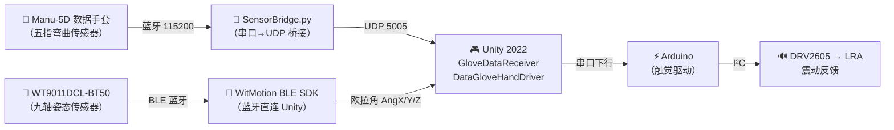

# 基于数据手套的虚拟手交互与触觉反馈系统

> 本科毕业设计 · 通过 Elastreme Sense Manu-5D 数据手套采集手指弯曲数据，驱动 Unity 虚拟手实时运动；通过 WitMotion WT9011DCL-BT50 九轴传感器获取手腕姿态，同步手部空间旋转；抓取交互时通过 Arduino + DRV2605 触觉芯片产生震动反馈。

---

## 系统架构



### 两路数据融合

| 数据源 | 传输方式 | 提供的数据 | 控制目标 |
|--------|---------|-----------|---------|
| Manu-5D 手套 | 蓝牙→串口→SensorBridge.py→UDP | 五指弯曲度 (0-1800) | 15 个手指骨骼关节旋转 |
| WT9011DCL-BT50 | BLE 蓝牙→WitMotion SDK→Unity | 欧拉角 AngX/Y/Z | 手腕整体空间旋转 |

两路数据在 `DataGloveHandDriver` 中融合：手指弯曲来自 `GloveDataReceiver`，手腕旋转来自 `DevicesManager`。

---

## 核心文件一览

| 文件 | 一句话说明 | 角色 |
|------|-----------|------|
| `SensorBridge.py` | Python 脚本，读取手套蓝牙串口数据并通过 UDP 转发 | **数据桥接层** |
| `GloveDataReceiver.cs` | 接收 UDP 数据（或键盘模拟），归一化为 0~1 | **数据输入层** |
| `DataGloveHandDriver.cs` | 驱动手指骨骼旋转 + 手腕姿态同步 | **骨骼驱动层** |
| `WitMotionConnector.cs` | 管理 WT9011DCL-BT50 蓝牙扫描/连接/断开 | **姿态传感器管理** |
| `HandSceneSetup.cs` | 运行时自动计算网格位置并定位摄像机 | **场景管理层** |
| `RiggedHandPrefabSetup.cs` | 编辑器工具，一键生成 Prefab 并放入场景 | **编辑器工具** |

### SDK 文件（WitMotion 官方）

| 目录 | 说明 |
|------|------|
| `Scripts/Bluetooth/` | BLE 底层通信（BleApi、BlueScanner、BlueConnector） |
| `Scripts/Device/` | 设备管理与数据解析（DevicesManager、DeviceModel） |

### 文件间协作流程

```
运行时数据流：

  ┌─ 手指弯曲 ─────────────────────────────────────┐
  │                                                  │
  │  SensorBridge.py（外部 Python 进程）              │
  │       │  UDP "1504,900,100,0,0,..."              │
  │       ▼                                          │
  │  GloveDataReceiver                               │
  │       │  FingerValues[0..4] (0~1)                │
  │       ▼                                          │
  │  DataGloveHandDriver ──→ 旋转 15 个手指骨骼      │
  │                                                  │
  └──────────────────────────────────────────────────┘

  ┌─ 手腕姿态 ─────────────────────────────────────┐
  │                                                  │
  │  WitMotionConnector                              │
  │       │  扫描 BLE → 连接 WT9011DCL-BT50         │
  │       ▼                                          │
  │  WitMotion SDK (DevicesManager)                  │
  │       │  AngX, AngY, AngZ 欧拉角                 │
  │       ▼                                          │
  │  DataGloveHandDriver ──→ 旋转手腕根节点          │
  │                                                  │
  └──────────────────────────────────────────────────┘

  HandSceneSetup  ← 挂载在摄像机上，每帧跟踪手部位置
```

---

## 硬件需求

| 硬件 | 说明 |
|------|------|
| Elastreme Sense Manu-5D | 无线数据手套，采集五根手指弯曲角度 |
| WT9011DCL-BT50 | 九轴姿态传感器（蓝牙），获取手腕空间旋转 |
| Arduino（Uno / Nano） | 触觉反馈驱动（I²C 控制 DRV2605） |
| DRV2605 触觉驱动模块 | TI 触觉驱动芯片 |
| 线性马达（LRA） | 与 DRV2605 配合，产生震动触觉反馈 |
| PC（Windows 10/11） | 运行 Unity 编辑器 + SensorBridge.py |

---

## 软件需求

| 软件 | 版本 / 说明 |
|------|------------|
| Unity Editor | **2022.3.62f3** (LTS) |
| API 兼容级别 | **.NET Framework**（WitMotion SDK 和串口通信依赖） |
| Python | 3.x（运行 SensorBridge.py） |
| Python 依赖 | `pip install pyserial` |
| Arduino IDE | 1.8.x 或 2.x（烧录触觉反馈固件） |

> 本项目已移除所有 VR/XR 相关包，不依赖 VR 头显。

---

## 项目结构详解

```
My project/
├── Assets/
│   ├── Editor/
│   │   └── RiggedHandPrefabSetup.cs     # 一键生成手部 Prefab 的编辑器工具
│   │
│   ├── Materials/
│   │   └── HandSkin.mat                 # 手部皮肤材质（URP Lit）
│   │
│   ├── Models/
│   │   └── Rigged Hand.fbx             # 带骨骼的手部模型（Blender 导出）
│   │
│   ├── Prefabs/Hands/
│   │   └── LeftHand.prefab             # 左手预制体（由工具自动生成）
│   │
│   ├── Scenes/
│   │   └── SampleScene.unity           # 主场景
│   │
│   └── Scripts/
│       ├── SensorBridge.py             # Python 串口→UDP 桥接
│       ├── GloveDataReceiver.cs        # UDP 数据接收 + 键盘模拟
│       ├── DataGloveHandDriver.cs      # 骨骼驱动（手指弯曲 + 手腕姿态）
│       ├── WitMotionConnector.cs       # WitMotion 蓝牙扫描/连接管理
│       ├── HandSceneSetup.cs           # 摄像机自动对准手部
│       │
│       ├── Bluetooth/                  # WitMotion BLE SDK
│       │   ├── BleApi/
│       │   │   ├── BleApi.cs           #   BLE 底层 API（调用 BleWinrtDll.dll）
│       │   │   └── BleWinrtDll.dll     #   Windows BLE 原生通信库
│       │   ├── BlueScanner.cs          #   蓝牙设备扫描
│       │   └── BlueConnector.cs        #   蓝牙连接与数据接收
│       │
│       └── Device/                     # WitMotion 设备管理
│           ├── DevicesManager.cs       #   设备列表管理（单例）
│           └── DeviceModel.cs          #   传感器数据解析（Acc/Ang/Mag）
│
├── Packages/manifest.json
└── ProjectSettings/
```

### 各文件详细说明

#### `Scripts/SensorBridge.py` — 数据桥接层

- **运行方式**：在 Unity 外部独立运行 `python SensorBridge.py`
- **功能**：读取手套蓝牙串口数据（115200 波特率），去掉末尾分号，通过 UDP 发送到 `127.0.0.1:5005`
- **配置**：修改脚本顶部的 `SERIAL_PORT`（默认 COM3）和 `UDP_PORT`（默认 5005）

#### `Scripts/GloveDataReceiver.cs` — 数据输入层

- **挂载位置**：场景中的 `GloveManager` 对象
- **两种模式**：
  - **键盘模拟**（默认开启）：按 1-5 键弯曲对应手指，Space 握拳
  - **UDP 接收**：取消勾选 `Use Keyboard Simulation` 后，监听 UDP 端口
- **数据处理**：解析前 5 个值（0-1800），归一化为 0-1，自动反转通道顺序
- **输出**：`FingerValues[5]` 数组

#### `Scripts/DataGloveHandDriver.cs` — 骨骼驱动层

- **挂载位置**：`LeftHand` Prefab 的根对象上
- **双重职责**：
  1. **手指弯曲**：读取 `GloveDataReceiver.FingerValues`，旋转 15 个骨骼关节
  2. **手腕旋转**：读取 WitMotion SDK 的 `DeviceModel.GetDeviceData("AngX/Y/Z")`，通过欧拉角→四元数转换控制手部根节点旋转
- **坐标系映射**：Inspector 中可调 `Axis Sign` 和 `Axis Remap`，用于适配传感器佩戴方向
- **可调参数**：`enableWristRotation`（开关手腕旋转）、`wristSmoothSpeed`（手腕平滑）

#### `Scripts/WitMotionConnector.cs` — 姿态传感器管理

- **挂载位置**：`GloveManager` 上（运行 `Tools → Setup Rigged Hand Prefab` 时会自动添加）
- **实现要点**：不单独依赖 SDK 的 `BlueScanner` 单次轮询线程，改为在 `Update` 中持续调用 `BleApi.PollDevice()`，避免漏扫
- **关键参数**：
  - `Connect Even If Not Connectable`（默认开启）：Windows 常对 WitMotion 广播报 `connectable=False`，仍可 GATT 连接；关闭则只连 `connectable=True` 的设备
  - `Verbose Scan Log`：在 Console 输出每条广播更新（前缀 `[仅扫描]`，区别于真正连接日志 `>>>`）
- **API**：`Scan()` / `StopScan()` / `Disconnect()`，可绑定 UI 按钮

#### `Scripts/HandSceneSetup.cs` — 场景管理层

- **挂载位置**：主摄像机上
- **功能**：通过 `Renderer.bounds` 计算手部网格实际位置，自动定位摄像机

---

## 快速开始

### 1. 生成手部 Prefab（首次使用）

```
Tools → Setup Rigged Hand Prefab
```

### 2. 键盘模拟测试（无硬件）

1. 点击 **Play**
2. 按 1-5 键弯曲对应手指，Space 握拳

### 3. 连接手套（手指弯曲）

1. `pip install pyserial`
2. 修改 `SensorBridge.py` 中 `SERIAL_PORT` 为手套蓝牙对应的 COM 口
3. 运行 `python Assets/Scripts/SensorBridge.py`
4. Unity 中取消勾选 `GloveManager` 上的 `Use Keyboard Simulation`
5. Play

### 4. 连接姿态传感器（手腕旋转）

1. **关闭**维特官方上位机及其他占用该 BLE 的程序（同一时刻只能被一个应用连接）
2. 开启 WT9011DCL-BT50 电源（指示灯闪烁）
3. `GloveManager` 上应有 `WitMotionConnector`（可重新运行 `Tools → Setup Rigged Hand Prefab` 自动补齐）
4. 建议保持 **`Connect Even If Not Connectable` 勾选**（见下方「修复记录」）
5. Play；Console 出现 `>>> 正在发起 GATT 连接` / `>>> GATT 已调用 OpenDevice` 表示已发起连接
6. 在 `LeftHand` 的 `DataGloveHandDriver` 上勾选 **`Enable Wrist Rotation`**

> **旋转方向不对？** 在 `DataGloveHandDriver` 中调整 `Axis Sign` 与 `Axis Remap`。

> **官方文档提示**：模块固件中的 **`autoConnection` 不要打开**，否则易出现连接慢、失败；与 Unity 里脚本的「Auto Connect」不是同一项。

---

## WitMotion BLE 连接问题与修复记录（备忘）

集成过程中曾出现「扫不到设备」「扫到 WT901BLE67 却被跳过」「超时无设备」等现象，原因与对策如下。

| 现象 | 原因 | 修复方式 |
|------|------|----------|
| 早期日志显示「跳过非 WT 设备: WT901BLE67」 | 误把名称含 WT 但 `connectable=False` 的包当成不可连；且 BLE 名称与 `isConnectable` 往往**分多次回调**，不能单次判定 | 按 `deviceId` 累积 `name` / `isConnectable` 更新后再判断；并区分「仅扫描」与「已发起连接」日志 |
| 扫描超时、始终无设备 | 仅用 SDK `BlueScanner` 时后台线程轮询窗口短，或 `BleApi.Quit()` 后立即 `StartDeviceScan()` 无缓冲 | 改用 **`Update` 中持续 `BleApi.PollDevice()`**；`Scan` 前 **`BleApi.Quit()` 后等待约 0.5s** 再 `StartDeviceScan()` |
| Console 有广播日志但手不转 | 把「扫描到广播」误认为「已连接」；或 `connectable=False` 时从未调用 `OpenDevice()` | 明确日志前缀；默认开启 **`connectEvenIfNotConnectable`**，名称匹配 `WT` 即尝试 `OpenDevice()` |
| 主线程外直接 `OpenDevice()` | 官方 Demo 在 UI（主线程）里连接 | 连接逻辑放在主线程（本脚本在判定后于 `Update` 中调用） |

**如何判断已真正发起连接**：以 Console 中是否出现 `>>> 正在发起 GATT 连接` 为准；仅有 `[仅扫描] 设备广播更新` 仅表示发现广播，不等于 GATT 已连上。

---

## 已知问题与待办

```
已完成:
[x] 五指独立弯曲控制（15 骨骼关节）
[x] 骨骼自动查找绑定（Blender .L 命名规范）
[x] SensorBridge.py 蓝牙串口→UDP 桥接
[x] GloveDataReceiver UDP 接收 + 键盘模拟
[x] WitMotion WT9011DCL-BT50 蓝牙连接集成（PollDevice 持续扫描 + connectable 标志 workaround）
[x] 手腕姿态旋转（欧拉角，可配置坐标系映射）
[x] RiggedHandPrefabSetup 自动为 GloveManager 添加 WitMotionConnector
[x] 移除 VR/XR 依赖
[x] 摄像机动态定位（Renderer bounds）

待办:
[ ] 调试坐标系映射（Axis Sign / Axis Remap 实测调参）
[ ] Unity → Arduino 串口触觉指令发送
[ ] 抓取判定逻辑（多指协同）
[ ] DRV2605 震动模式可配置化
[ ] 确认弯曲轴方向并微调 bendAxis / maxBendAngle
[ ] 场景美化与演示物体
[ ] 打包 Build 测试
```

---

## 作者信息

| | |
|--|--|
| 项目类型 | 本科毕业设计 |
| 开发环境 | Unity 2022.3.62f3 · Windows 10/11 · Python 3.x |
| 指导方向 | 虚拟现实交互 · 触觉反馈 · 人机交互 |
