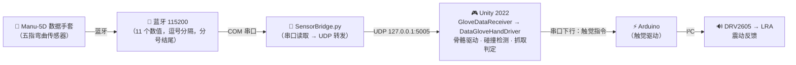

# 基于数据手套的虚拟手交互与触觉反馈系统

> 本科毕业设计 · 通过 Elastreme Sense Manu-5D 数据手套采集手指弯曲数据，驱动 Unity 虚拟手实时运动，并在抓取交互时通过 Arduino + DRV2605 触觉芯片产生线性马达震动反馈。

---

## 系统架构



### 数据格式

手套通过蓝牙以 115200 波特率发送数据，格式为：

```
1504,900,100,0,0,0,0,0,0,0,0;
```

- **11 个数值**，逗号分隔，分号结尾
- **前 5 个**为手指弯曲度（0-1800 = 0.0°-180.0°），通道顺序：CH1=小指, CH2=无名指, CH3=中指, CH4=食指, CH5=拇指
- 后 6 个为保留数据

---

## 核心文件一览

| 文件 | 一句话说明 | 角色 |
|------|-----------|------|
| `SensorBridge.py` | Python 脚本，读取蓝牙串口数据并通过 UDP 转发给 Unity | **数据桥接层** |
| `GloveDataReceiver.cs` | 接收 UDP 数据（或键盘模拟），归一化为 0~1 | **数据输入层** |
| `DataGloveHandDriver.cs` | 根据弯曲值旋转手部 15 个骨骼关节 | **骨骼驱动层** |
| `HandSceneSetup.cs` | 运行时自动计算网格位置并定位摄像机 | **场景管理层** |
| `RiggedHandPrefabSetup.cs` | 编辑器工具，一键生成 Prefab 并放入场景 | **编辑器工具** |

### 文件间协作流程

```
运行时数据流：

  SensorBridge.py（外部 Python 进程）
       │
       │  UDP "1504,900,100,0,0,..."
       ▼
  GloveDataReceiver            ← 后台线程接收 UDP，解析前 5 个值
       │                          归一化 0-1800 → 0.0-1.0
       │                          反转通道顺序（CH1 小指→CH5 拇指 → 拇指在前）
       │  FingerValues[0..4]
       ▼
  DataGloveHandDriver          ← 每帧读取 FingerValues，旋转 15 个骨骼关节
       │                          保持初始旋转 + 叠加弯曲角度
       │                          近端关节分配更多角度（0.40/0.35/0.25）
       ▼
  SkinnedMeshRenderer           ← Unity 自动根据骨骼变换更新网格显示
```

```
编辑器配置流程（只需运行一次）：

  Tools → Setup Rigged Hand Prefab
       │
       ▼
  RiggedHandPrefabSetup         ← 从 FBX 生成 Prefab，放入场景
       │                           自动创建 GloveManager（含 GloveDataReceiver）
       │                           自动在主摄像机上添加 HandSceneSetup
       │                           自动连接 DataGloveHandDriver → GloveDataReceiver
       ▼
  场景就绪，按 Play 即可测试
```

---

## 硬件需求

| 硬件 | 说明 |
|------|------|
| Elastreme Sense Manu-5D | 无线数据手套，采集五根手指弯曲角度 |
| 蓝牙接收器 | 与手套配对，PC 识别为 COM 串口 |
| Arduino（Uno / Nano） | 触觉反馈驱动（I²C 控制 DRV2605） |
| DRV2605 触觉驱动模块 | TI 触觉驱动芯片 |
| 线性马达（LRA） | 与 DRV2605 配合，产生震动触觉反馈 |
| PC（Windows 10/11） | 运行 Unity 编辑器 + SensorBridge.py |

---

## 软件需求

| 软件 | 版本 / 说明 |
|------|------------|
| Unity Editor | **2022.3.62f3** (LTS) |
| Python | 3.x（运行 SensorBridge.py） |
| Python 依赖 | `pip install pyserial` |
| Arduino IDE | 1.8.x 或 2.x（烧录触觉反馈固件） |

> 本项目已移除所有 VR/XR 相关包，不依赖 VR 头显。

---

## 项目结构详解

```
My project/
├── Assets/
│   ├── Editor/
│   │   └── RiggedHandPrefabSetup.cs     # 一键生成手部 Prefab 的编辑器工具
│   │
│   ├── Materials/
│   │   └── HandSkin.mat                 # 手部皮肤材质（URP Lit）
│   │
│   ├── Models/
│   │   └── Rigged Hand.fbx             # 带骨骼的手部模型（Blender 导出）
│   │
│   ├── Prefabs/Hands/
│   │   └── LeftHand.prefab             # 左手预制体（由工具自动生成）
│   │
│   ├── Scenes/
│   │   └── SampleScene.unity           # 主场景
│   │
│   └── Scripts/
│       ├── SensorBridge.py             # Python 串口→UDP 桥接脚本
│       ├── GloveDataReceiver.cs        # UDP 数据接收 + 键盘模拟
│       ├── DataGloveHandDriver.cs      # 骨骼自动绑定 + 旋转驱动
│       └── HandSceneSetup.cs           # 摄像机自动对准手部模型
│
├── Packages/manifest.json
└── ProjectSettings/
```

### 各文件详细说明

#### `Scripts/SensorBridge.py` — 数据桥接层

- **运行方式**：在 Unity 外部独立运行 `python SensorBridge.py`
- **功能**：读取蓝牙串口数据（115200 波特率），去掉末尾分号，通过 UDP 发送到 `127.0.0.1:5005`
- **配置**：修改脚本顶部的 `SERIAL_PORT`（默认 COM3）和 `UDP_PORT`（默认 5005）

#### `Scripts/GloveDataReceiver.cs` — 数据输入层

- **挂载位置**：场景中的 `GloveManager` 对象
- **两种模式**：
  - **键盘模拟**（默认开启）：按 1-5 键弯曲对应手指，Space 握拳
  - **UDP 接收**：取消勾选 `Use Keyboard Simulation` 后，监听 UDP 端口接收 SensorBridge.py 转发的数据
- **数据处理**：解析前 5 个值（0-1800），归一化为 0-1，自动反转通道顺序（CH1 小指→CH5 拇指 → FingerValues[0]=拇指）
- **输出**：`FingerValues[5]` 数组供 `DataGloveHandDriver` 读取

#### `Scripts/DataGloveHandDriver.cs` — 骨骼驱动层

- **挂载位置**：`LeftHand` Prefab 的根对象上
- **依赖**：引用 `GloveDataReceiver`（通过 Inspector 的 `Glove Data` 字段）
- **骨骼查找**：`Start()` 时自动在子层级中按名称搜索 15 个骨骼（如 `thumb.01.L`）
- **旋转方式**：保持骨骼初始旋转 + 叠加弯曲角度，近端关节分配更多角度（0.40/0.35/0.25）
- **可调参数**：弯曲轴 `bendAxis`、最大角度 `maxBendAngle`、平滑速度 `smoothSpeed`

#### `Scripts/HandSceneSetup.cs` — 场景管理层

- **挂载位置**：主摄像机上
- **功能**：通过 `Renderer.bounds` 计算手部网格实际位置，自动定位摄像机

---

## 快速开始

### 1. 生成手部 Prefab（首次使用）

打开 Unity 项目，运行：

```
Tools → Setup Rigged Hand Prefab
```

### 2. 键盘模拟测试

1. 点击 **Play**
2. 按 1-5 键弯曲对应手指，Space 握拳
3. 确认手指弯曲正常

### 3. 连接真实手套

1. 安装 Python 依赖：`pip install pyserial`
2. 确认手套蓝牙已配对，记下 COM 端口号
3. 修改 `SensorBridge.py` 中的 `SERIAL_PORT`
4. 在命令行运行：

```bash
python Assets/Scripts/SensorBridge.py
```

5. 回到 Unity，在 `GloveManager` 上**取消勾选 `Use Keyboard Simulation`**
6. 点击 **Play**，手指应随手套数据实时运动

> **注意**：如果手指弯曲方向不对，调整 `DataGloveHandDriver` 中对应手指的 `Bend Axis`；如果通道顺序不对，取消勾选 `GloveDataReceiver` 的 `Reverse Finger Order`。

---

## 已知问题与待办

```
已完成:
[x] 实现五指独立弯曲控制（DataGloveHandDriver 逐骨骼旋转）
[x] 骨骼自动查找绑定（基于 Blender .L 命名规范）
[x] 移除 VR/XR 相关依赖
[x] 清理未使用的资源文件
[x] 修复摄像机定位问题（Renderer bounds 动态计算）
[x] 实现 SensorBridge.py 蓝牙串口→UDP 桥接
[x] GloveDataReceiver 改为 UDP 接收模式（兼容键盘模拟）

待办:
[ ] 实现 Unity → Arduino 串口触觉指令发送
[ ] 抓取判定逻辑（多指协同判断）
[ ] DRV2605 震动模式可配置化
[ ] 确认弯曲轴方向并微调 bendAxis / maxBendAngle
[ ] 手部位置追踪（扩展 SensorBridge 传递位置数据）
[ ] 场景美化与演示物体补充
[ ] 打包 Build 测试
```

---

## 作者信息

| | |
|--|--|
| 项目类型 | 本科毕业设计 |
| 开发环境 | Unity 2022.3.62f3 · Windows 10/11 · Python 3.x |
| 指导方向 | 虚拟现实交互 · 触觉反馈 · 人机交互 |
