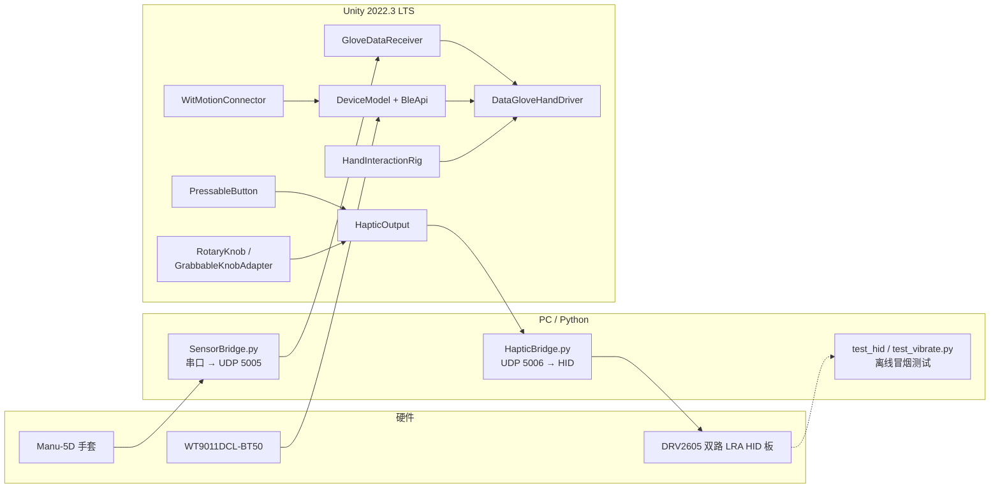

# 基于数据手套的虚拟手交互与触觉反馈系统

> 本科毕业设计：用 **Elastreme Sense Manu-5D** 数据手套采集五指弯曲，经 **Python 串口桥** 以 UDP 送入 Unity，驱动 **Rigged Hand** 骨骼；用 **WitMotion WT9011DCL-BT50**（BLE）提供手腕姿态与相对位移估计；场景内为 **非 XR** 的 Trigger / Rigidbody 交互；触觉侧由 Unity 通过 UDP 把 DRV2605 库振动 ID 推给 **`HapticBridge.py`**，Python 端再以 USB **HID** 写入双路 LRA 马达板（**与 SensorBridge.py 完全对偶的反向通道**），仓库根目录额外提供独立 HID 测试脚本作为离线验证手段。

阅读本文后，你应能回答：**数据从哪来、Unity 里谁在处理、没硬件怎么调试、蓝牙与 Python 各负责什么、按钮/旋钮怎么触发振动**。

---

## 1. 项目做什么

| 能力 | 实现要点 |
|------|-----------|
| 手指跟随 | 手套 → 串口 → `SensorBridge.py` → UDP → `GloveDataReceiver` → `DataGloveHandDriver` 旋转 5 指骨骼 |
| 手腕姿态与位移 | WT9011 BLE → `WitMotionConnector` + `DeviceModel` 解析 → `DataGloveHandDriver` 做欧拉角显示旋转与**近场、短距离**的相对位移增强（重力低通估计 + 启动标定 + 冻结窗口 + 弹簧回中；可选平面模式与缓慢回中） |
| 抓取与碰触 | `HandInteractionRig` 在指尖挂 Trigger；`FingerTipRelay` 转发事件；`TouchableObject` 提供高亮与 `UnityEvent`（可接触觉串口等） |
| 场景与资源 | `RiggedHandPrefabSetup` 一键从 FBX 生成左手 Prefab 并布置场景；`HandSceneSetup` 让主摄像机跟随手部包围盒 |
| 控制台物理 UI | `ControlPanelSetup` 生成 **ControlPanel**（桌、双按钮、`PressableButton` / `ButtonTriggerZone`、`LampController`、旋钮）；指尖 **`FingerTip`** + 触发体即可按压，**无需**在按钮上挂 `GloveDataReceiver` |
| 旋钮交互 | **速率累加 + snap-to-grab** 旋钮（v12）：`GrabbableKnobAdapter` 拦截 `TouchableObject` 抓取，把旋钮钉在面板上、把虚拟手"焊"到当前位置（`lockWristPosition` + 重锚），抓取期间冻结手腕方向（`lockWristRotation`）、对底层 pinch 抖动做去抖；`RotaryKnob` 读 `DataGloveHandDriver.RawWristTargetPosition`，按"每帧位移 → 速度阈值过滤 → 累加器 → degreesPerMeter"映射为角度（**速率累加** 而非绝对位移，专治 IMU 弹簧回中导致的"灯亮一下又暗回去"）；`MasterBrightnessController` 把 0–1 输出同步分发给一组 `LampController`，并保留键盘 0–9 / `=` 旁路用于诊断 |
| 触觉反馈输出 | **Unity → UDP → `HapticBridge.py` → HID → DRV2605 双路 LRA**（与 SensorBridge.py 完全对偶）。`HapticOutput` 把按钮咔嗒、旋钮步进、抓握等事件转成 `EFFECT,L,R` 文本指令发到 `127.0.0.1:5006`；菜单 **Tools → Setup Haptics** 一键把场景里所有 `PressableButton.onPressed` / `RotaryKnob.onStepClicked` 接上；不需要 Unity 直接持有 HID 库 |
| 无手套调试 | `DataGloveHandDriver` 的 **Space 键全握拳**（`enableKeyboardFistOverride`）+ `GloveDataReceiver` 的键盘模拟（1–5 单指）；`SceneViewHandKeyboardBridge` 在 Scene 视图用 WASD 等微调手部位移（运行中）；`GrabbableKnobAdapter` 可启用 **`useDirectFingerBendGrab`** 直接根据手指弯曲度抓取旋钮，绕过触发器与 pinch 检测 |

本项目 **未** 在 `Packages/manifest.json` 中引入 **XR Interaction Toolkit**；交互基于自定义 Trigger / 捏合阈值与物理刚体。

---

## 2. 系统架构与数据流



**四条主通道简述：**

1. **手套（输入，串口→UDP）**：蓝牙虚拟串口（上位机或系统枚举为 COMx）→ `SensorBridge.py` 用 `read_until(b';')` 读到分号包尾、去分号 → UDP `127.0.0.1:5005`（默认）→ `GloveDataReceiver` 解析 11 个逗号分隔数值中的前 5 个为弯曲（0–1800 对应 0°–180°），归一化后交给 `DataGloveHandDriver`。运行前请关闭占用串口的 **OneCOM** 等上位机，否则会与 Python 抢端口。`SERIAL_PORT` / `BAUD_RATE` / `VERBOSE_PRINT` 都可用环境变量覆盖（见 §3.2）。
2. **姿态传感器（输入，BLE→Unity）**：`WitMotionConnector` 使用 `Assets/Scripts/Bluetooth/BleApi`（WinRT 原生 `BleWinrtDll.dll`）持续轮询扫描，匹配名称含 **WT** 的设备并连接；数据经 `DeviceModel` 线程解析，供 `DataGloveHandDriver` 做手腕旋转与受限相对位移估计。当前位移链路**不以远距离连续平移为目标**，而是服务**近场交互**：在 **慢速低通估计重力 + 启动静止标定 + 转动冻结窗口 + 弹簧回中** 的基础上，可通过 **`usePlanarPositionOnly`** 自动压掉 `positionAxisWeight` 中最不稳定的一轴（仅两轴参与位移），并用 **`positionRecenteringSpeed`** 在非静止状态下极慢地将偏移拉回零，减轻长期累计漂移。项目中另有 `BlueScanner` / `BlueConnector` 通用扫描连接栈，当前 WT 流程以 `WitMotionConnector` 为主（避免短轮询漏设备）。
3. **触觉（输出，UDP→HID，与手套通道完全反向）**：场景里挂 **`HapticOutput`** 单例，按钮 `onPressed` / 旋钮 `onStepClicked` 等事件触发 `PlayButtonClick()` / `PlayKnobStep()`，组件以 UTF-8 文本 `EFFECT,L,R` 通过 UDP `127.0.0.1:5006`（默认）发送给 **`HapticBridge.py`**；Python 端打开 **VID `0x674E` / PID `0x000A`** 的 HID 板，按 *『手机多马达振动驱动板』第 5.2 节* 拼装 65 字节 0xBB 报文（左路写 byte[2]、右路写 byte[10]），调用 DRV2605 库振动 ID（0–123）。所有 HID 依赖只在 Python 端，Unity 端零原生依赖。也可发 `STOP`（两路停振）/ `PING`（bridge 回 `PONG`）。`HapticOutput.minIntervalMillis` 做 35 ms 的发送节流，避免旋钮快速旋转时把 LRA 糊成一团。
4. **离线 HID 冒烟测试**：根目录 `test_hid.py`（0xAA 命令）/ `test_vibrate.py`（遍历 0xBB 库振动）不依赖 Unity，可用于在没启动游戏前先确认马达板/驱动可用。

---

## 3. 运行环境与依赖

### 3.1 硬件（与代码假设一致）

- Elastreme Sense **Manu-5D** 数据手套（输出分号结尾的 ASCII 行，波特率默认 **115200**）
- WitMotion **WT9011DCL-BT50**（BLE，广播名通常含 **WT**）
- Windows PC + Unity 编辑器
- 可选：HID 双路触觉板（上述 VID/PID）；或 Arduino + DRV2605 + LRA（固件/协议以你实际上位机为准）

### 3.2 软件版本

- **Unity**：`2022.3.62f3` LTS（见 `ProjectSettings/ProjectVersion.txt`）
- **Python 3.x**：
  - `pyserial` —— `SensorBridge.py`（手套串口→UDP）。可用环境变量 `SERIAL_PORT` / `BAUD_RATE` / `VERBOSE_PRINT` 覆盖默认值；脚本内默认 `SERIAL_PORT=COM4`、`BAUD_RATE=115200`、`UDP_PORT=5005`，并使用 `read_until(b';')` + `set_low_latency_mode(True)` 降低端到端延迟。
  - `hid`（[`hidapi`](https://pypi.org/project/hidapi/)） —— `HapticBridge.py`（Unity UDP→HID）与根目录的 `test_hid.py` / `test_vibrate.py`。`HapticBridge.py` 同样支持环境变量覆盖：`HAPTIC_UDP_PORT`（默认 5006）、`HAPTIC_HID_VID`（默认 `0x674e`）、`HAPTIC_HID_PID`（默认 `0x000a`）、`HAPTIC_VERBOSE`（`"1"` 打开每帧日志）。
- **Arduino IDE**（若使用 Arduino 触觉方案；当前主路径直接走 HID 板，Arduino 仅作为可选替代）

### 3.3 Unity 包说明

`Packages/manifest.json` 为 Unity 默认特性集（UGUI、Timeline、Visual Scripting 等），**不含** XR Interaction Toolkit。虚拟手依赖 **Physics**、**Animation 骨骼** 与自定义脚本。

---

## 4. 仓库目录结构（与仓库一致）

```
My project/
├── README.md
├── test_hid.py              # HID 单发振动测试（命令 0xAA）
├── test_vibrate.py          # 遍历 DRV2605 效果 ID（命令 0xBB）
├── Assets/
│   ├── Editor/
│   │   ├── RiggedHandPrefabSetup.cs   # 菜单 Tools → Setup Rigged Hand Prefab
│   │   ├── ControlPanelSetup.cs       # 菜单 Tools → Setup Control Panel（控制台层级与按钮→灯绑定）
│   │   ├── KnobInteractionSetup.cs    # 菜单 Tools → Setup Knob Interaction（一键把 GrabZone 抓取链路、RotaryKnob 字段、MasterController 与持久 onValueChanged 配齐）
│   │   ├── HapticSetup.cs             # 菜单 Tools → Setup Haptics（创建 HapticController、把所有按钮/旋钮事件持久绑定到 HapticOutput）
│   │   └── SceneViewHandKeyboardBridge.cs  # 运行时在 Scene 视图用键盘微调手部位置
│   ├── Materials/
│   │   ├── HandSkin.mat
│   │   └── ControlPanel/              # 控制台灰/红/蓝/灯泡材质（由 Setup 生成或使用）
│   ├── Models/
│   │   └── Rigged Hand.fbx
│   ├── Prefabs/Hands/
│   │   └── LeftHand.prefab
│   ├── Scenes/
│   │   └── SampleScene.unity
│   └── Scripts/
│       ├── SensorBridge.py        # 手套串口 → UDP 5005 桥；read_until(b';') + low-latency 模式
│       ├── HapticBridge.py        # Unity UDP 5006 → DRV2605 HID 双路马达板（与 SensorBridge 完全对偶）
│       ├── GloveDataReceiver.cs
│       ├── DataGloveHandDriver.cs
│       ├── WitMotionConnector.cs
│       ├── HandInteractionRig.cs
│       ├── TouchableObject.cs
│       ├── FingerTipRelay.cs      # 指尖 Trigger → HandInteractionRig
│       ├── PressableButton.cs     # 物理按压按钮（指尖 Trigger → ButtonTriggerZone）
│       ├── ButtonTriggerZone.cs   # 转发 FingerTip 进入/离开给 PressableButton
│       ├── LampController.cs      # 灯泡开关与亮度（可与按钮 UnityEvent 绑定）
│       ├── RotaryKnob.cs          # 抓取式虚拟旋钮：v12 速率累加 + 速度阈值过滤 → 角度
│       ├── GrabbableKnobAdapter.cs# 桥接 TouchableObject 抓取到 RotaryKnob，冻结手腕；v11 还可直接用手指弯曲度抓取
│       ├── MasterBrightnessController.cs # 把 0~1 值同步分发到一组 LampController
│       ├── HapticOutput.cs        # 单例：把按钮/旋钮事件转成 EFFECT,L,R 文本 UDP 发给 HapticBridge.py
│       ├── HandSceneSetup.cs      # 主摄像机对准手部
│       ├── Bluetooth/
│       │   ├── BlueConnector.cs   # GATT 连接与收包线程
│       │   ├── BlueScanner.cs     # 通用 BLE 扫描（可与 WitMotionConnector 并存注意资源）
│       │   └── BleApi/
│       │       ├── BleApi.cs      # WinRT BLE 封装
│       │       └── BleWinrtDll.dll
│       └── Device/
│           ├── DeviceModel.cs     # 单设备解析、线程、OnKeyUpdate
│           └── DevicesManager.cs  # 多设备字典与当前设备
├── Packages/
│   └── manifest.json
└── ProjectSettings/
```

---

## 5. 核心脚本职责速查

| 组件 / 脚本 | 职责 |
|-------------|------|
| `SensorBridge.py` | 读手套串口分号包尾 → UDP 发送整行字符串。改用 `serial.read_until(b';')` 而非 `readline()`，端到端延迟显著下降；同时尝试 `set_low_latency_mode(True)`。`SERIAL_PORT` / `BAUD_RATE` / `VERBOSE_PRINT` 都接受环境变量覆盖，默认 `COM4` / `115200` / 关闭打印 |
| `HapticBridge.py` | UDP `127.0.0.1:5006` 收 `EFFECT,L,R` / `STOP` / `PING` 文本指令 → 拼装 65 字节 0xBB 库振动报文 → HID 写到 DRV2605 双路板（VID `0x674E` / PID `0x000A`）。HID 掉线自动按 `RECONNECT_INTERVAL` 重开；`HAPTIC_UDP_PORT` / `HAPTIC_HID_VID` / `HAPTIC_HID_PID` / `HAPTIC_VERBOSE` 全部支持环境变量覆盖。`PING` 会原路返回 `PONG`，方便 Unity 端做"bridge 是否在跑"诊断 |
| `GloveDataReceiver.cs` | UDP 或键盘模拟 → 五指 0–1 弯曲数组；通道顺序可 `reverseFingerOrder` |
| `DataGloveHandDriver.cs` | 根据弯曲旋转骨骼；根据 `DeviceModel` 数据做手腕旋转、近场重力估计式相对位移（可选平面模式、缓慢回中）、转动冻结与调试键盘叠加。挂 **`[DefaultExecutionOrder(-200)]`**，每帧最先 `Update`，确保下游脚本读取手腕位置不滞后一帧。对外暴露五组交互钩子：① **`lockWristRotation`**——为 true 时跳过当前帧手腕旋转写入；② **`lockWristPosition` + `lockedWristPositionTarget`**——为 true 时每帧把 `transform.localPosition` 硬 snap 到目标点（visual snap-to-grab），但 IMU 内部积分继续运行；③ **`RawWristTargetPosition`**（只读）——本帧 IMU 计算出的、未经平滑/未受 lock 影响的世界目标位置；④ **`RebaseWristAnchorToCurrent()`**——把 IMU 积分器的"中性原点"重新锚定到当前 `localPosition`，并清空积分状态，用于解锁前避免"传送回初始位置"；⑤ **`enableKeyboardFistOverride` + `fistOverrideKey`（默认 Space）**——按住即把所有手指弯曲值强制为 1，方便键盘演示触发握拳路径（`HandInteractionRig` 的 fist 抓取、`GrabbableKnobAdapter` 的 direct-bend 抓取都吃这条） |
| `WitMotionConnector.cs` | WT 专用：长时扫描、`connectable=False` 时仍可选连接、连接 `DeviceModel` |
| `BleApi` + `BlueConnector` + `DeviceModel` | Windows BLE 底层、连接与字节流解析 |
| `HandInteractionRig.cs` | 指尖 Trigger、捏取/握拳阈值、吸附刚体；需根节点 **Kinematic Rigidbody**。两个宽松兜底判定 **`enableAnySingleFingerBentGrab`** / **`enableInverseBentGrab`** 默认**关闭**——前者会让"任意一指轻微弯曲就抓取"，后者在反向映射下会让"手张开五指≈0 = 一直在抓"，是触碰旋钮立即被吸附的常见原因。仅在确认手套映射方向后再单独开启；阈值字段已加 tooltip 说明"仅在对应开关 ON 时生效" |
| `FingerTipRelay.cs` | 挂在指尖球上，把 `OnTriggerEnter/Exit` 交给 `HandInteractionRig` |
| `TouchableObject.cs` | 可触摸物体：高亮、`allowPinchGrab`、触摸/抓取 `UnityEvent` |
| `RotaryKnob.cs` | **v12 速率累加旋钮**：抓取瞬间记录"上一帧手位置"和"基准角度"；每帧只取**自上一帧到这一帧的手部位移**沿 `displacementAxis` 投影，按 **速度过滤**（`driftVelocityThreshold`，默认 0.08 m/s）丢掉低于阈值的帧（这些是 IMU 弹簧回中产生的慢漂移，不是用户主动动作）后累加进 `_accumulatedAxisDisplacement`，再 ×`degreesPerMeter` ×`signFlip` 得到角度，钳制到 `[minAngle, maxAngle]` 并回写累加器（防止"积负债"导致反向需要先转回来）。`onValueChanged(float 0~1)` + `onStepClicked` 事件，`logAxisDiagnostics` 打开后每 ~0.3 s 打印三个轴累计 `|Δ|` 帮助选 `displacementAxis`。位置来源由 **`positionSource` + `useRawWristPosition`** 控制：默认开启时读 `RawWristTargetPosition`，这是 snap-to-grab 启用后旋钮还能转动的关键 |
| `GrabbableKnobAdapter.cs` | 挂在 **`Knob_01/GrabZone`** 子物体上（不在 Knob 根）。把 `TouchableObject.onGrabbed/onReleased` 转发到 `RotaryKnob.OnGrab/OnRelease`；`OnEnable` 缓存原 parent/pose，`Update` 持续恢复抵消 `TouchableObject.Grab()` 的 `SetParent(handAttach)`，把旋钮钉在面板上。抓取期间根据 `lockWristDuringGrab` / `snapHandToKnob` / `freezeAtCurrentHandPosition` 同时打开 `lockWristRotation` 与 `lockWristPosition`——**默认把虚拟手"焊"在触碰瞬间的当前位置**而不是 snap 到旋钮中心。`minLockHoldDuration`（默认 0.2 s）对底层 pinch 抖动做去抖，避免 grab/release 反复抖跳。释放时 `rebaseHandAnchorOnRelease` 先调 `RebaseWristAnchorToCurrent()` 再解锁，防止手"传送回胸前"。`OnDisable` 兜底复位两把锁与 `RotaryKnob` 状态。**v11 备用路径**：开启 `useDirectFingerBendGrab` 后，本组件直接监听 `GloveDataReceiver.FingerValues`，按 `fingerBendMode`（`AverageOfAll` 默认 / `ThumbAndIndexBoth` / `AnyFinger` / `IndexOnly`）聚合成 0–1 标量，越过 `grabBendThreshold` 抓取、跌破 `releaseBendThreshold` 释放，**完全绕开 `TouchableObject` / `HandInteractionRig` 捏合检测**——配合 Space 全握拳即可在没有任何触发器的最小化场景里测试旋钮→灯链路 |
| `MasterBrightnessController.cs` | 简单 fan-out：把 0~1 亮度值同步分发到一组 `LampController`，并在 value > 0 时自动 `SetOn(true)` 隐式点灯；常作为 `RotaryKnob.onValueChanged` 的接收端。`enableKeyboardTest` 默认开启，运行时按 **0–9** 设 0%–90%、按 **`=`** 设 100%——独立于旋钮的 fallback 通道，用于诊断"灯链路本身"是否畅通：键盘能改但旋钮不行 → 问题在 `onValueChanged` 绑定或 `RotaryKnob.positionSource`；键盘也改不了 → 检查 `master.lamps` |
| `HapticOutput.cs` | 触觉输出唯一入口（`Singleton`，`Instance` 自动 find）：`PlayButtonClick` / `PlayKnobStep` / `PlayKnobGrab` / `PlayTouchEnter`（接到 `UnityEvent`）和 `PlayEffect(L,R)` / `Stop()` / `Ping()`（代码调用）。每个预设效果都是 0–123 的 DRV2605 库振动 ID（默认按钮=1 Strong Click、旋钮步进=7 Soft Click、抓握=14 Strong Buzz、touch=0 关闭）。`minIntervalMillis`（默认 35 ms）做发送节流，宁可丢一次咔嗒也不让旋钮高速转动时把 LRA 糊成一团。`logSends=true` 时每条发送都打 Console，定位"按下没振"必备 |
| `HandSceneSetup.cs` | 挂主摄像机，`LateUpdate` 对准 `LeftHand` 渲染包围盒 |
| `RiggedHandPrefabSetup.cs` | 编辑器一键生成左手 Prefab、布置场景、默认键盘手套模式 |
| `HapticSetup.cs` | 编辑器菜单 **Tools → Setup Haptics**：场景里找/建 `HapticController` 并挂 `HapticOutput`；把所有 `PressableButton.onPressed` 持久绑定到 `HapticOutput.PlayButtonClick`、所有 `RotaryKnob.onStepClicked` 持久绑定到 `HapticOutput.PlayKnobStep`。重复执行只清自己加的 listener，不会吃掉用户手工添加的其他事件。整次配置走 `Undo` 系统 |
| `SceneViewHandKeyboardBridge.cs` | 编辑模式下 Scene 视图焦点时 WASD/QE 等控制位移（配合 `DataGloveHandDriver` 键盘位姿开关） |

**手套数据格式**（`GloveDataReceiver` 注释）：一行如 `1504,900,100,0,0,0,0,0,0,0,0` — 前 5 个数为 CH1–CH5 弯曲（小指→拇指），脚本可反转为拇指在前再驱动骨骼。

---

## 6. 快速启动

### 6.1 首次打开工程

1. 用 **Unity Hub** 打开本文件夹，确认编辑器版本为 **2022.3.62f3**（或同 2022.3 系列，避免大版本差异）。
2. 若场景中没有配置好的左手：菜单栏 **Tools → Setup Rigged Hand Prefab**，会生成 `Assets/Prefabs/Hands/LeftHand.prefab` 并配置 `SampleScene`（详见脚本对话框说明）。
3. 打开 `Assets/Scenes/SampleScene.unity`。

### 6.2 仅键盘调试（无手套、无传感器）

1. 选中场景中带 `GloveDataReceiver` 的对象，勾选 **Use Keyboard Simulation**。
2. Play：
   - **1–5** 控制五指弯曲，**Space** 握拳（`GloveDataReceiver.useKeyboardSimulation` 内置）。
   - 即使没勾键盘模拟，**`DataGloveHandDriver.enableKeyboardFistOverride`**（默认开启）也会让你按住 **Space** 把所有手指弯曲值强制为 1——这是给 `GrabbableKnobAdapter.useDirectFingerBendGrab` 与 `HandInteractionRig` 的 fist 抓取留的"键盘旁路"，演示中按 Space 即可一键握拳触发抓取。
   - **Scene** 视图聚焦时可用 **WASD / QE / PageUp-Down** 等微调位置（`SceneViewHandKeyboardBridge`）。
3. `DataGloveHandDriver` 中可单独开关手腕旋转/位置与键盘位置调试选项。

### 6.3 连接真实手套

1. 在 `Assets/Scripts/SensorBridge.py` 中设置 `SERIAL_PORT`、`BAUD_RATE`、`UDP_PORT`，与 `GloveDataReceiver` 的 **udpPort** 一致。也可用环境变量临时覆盖（PowerShell 示例：`$env:SERIAL_PORT = "COM4"; python Assets/Scripts/SensorBridge.py`）。
2. 终端执行：`python Assets/Scripts/SensorBridge.py`（或从你习惯的工作目录指向该文件）。脚本采用 `read_until(b';')` 等待分号包尾，半包会被丢弃，端到端延迟比 `readline()` 显著更低；想看实时数据流时把脚本顶部 `VERBOSE_PRINT = True` 打开（或设环境变量 `VERBOSE_PRINT=1` 后改脚本读取——当前脚本里 verbose 是常量，可按需简单改）。
3. 在 Unity 中 **取消勾选** `GloveDataReceiver` 的 **Use Keyboard Simulation**。
4. Play，观察 Console 与手指动画。

### 6.4 连接 WitMotion 传感器

1. 场景中确保有 `WitMotionConnector`（一键 Setup 会添加）。
2. 打开 WT9011 电源，Windows 蓝牙正常；Play 后等待自动扫描/连接（可在 Inspector 调整 `autoScan`、`autoConnect`、`scanTimeout` 等）。
3. 若旋转轴反向或漂移，在 `DataGloveHandDriver` 中调节 **axisSign / axisRemap**、死区与平滑参数。位置侧优先服务**近场、短距离**交互：通过 **`wristMaxOffset`** 限制最大偏移；演示求稳可开启 **`usePlanarPositionOnly`**；若偏移长期“黏”在一边可调 **`positionRecenteringSpeed`**；若平移偏弱或转腕假位移仍大，再调 **positionAxisWeight**、**wristPositionGain**、**gravityEstimateFilterSpeed**、**positionFreezeDuration**、**wristPositionSpring** 与 **wristVelocityDamping**。

### 6.5 配置抓取式旋钮（位移驱动 → 灯亮度）

旋钮链路独立于 XR 与传统 hover-rotate：抓取瞬间把虚拟手"焊"在当前世界位置（snap-to-grab），同时仍读取 IMU 计算出的 **`RawWristTargetPosition`** 沿指定世界轴的位移，按 `degreesPerMeter` 线性映射为角度。

#### 6.5.1 一键搭建（推荐）

只要先跑过 **`Tools → Setup Control Panel`**（会生成 `Knob_01/Visual`（自动挂好默认配置的 `RotaryKnob`）和 `Knob_01/GrabZone`），再跑 **`Tools → Setup Knob Interaction`** 即可。它会：

1. 把 `Knob_01` 根上历史残留的 `TouchableObject` / `GrabbableKnobAdapter` 移除（这两个旧组件会和 `GrabZone` 上的新链路冲突，是"旋钮跟手晃 / 灯不亮"的常见原因）。
2. 在 **`Knob_01/GrabZone`** 上配齐：`SphereCollider`（Trigger 关闭，让指尖球能触发）+ kinematic `Rigidbody` + `TouchableObject` + `GrabbableKnobAdapter`，并把 `MeshRenderer` 关掉（不可见的抓取体积）。
3. 把 `GrabbableKnobAdapter` 的 `touchable` / `targetKnob`（指向 `Visual` 上的 `RotaryKnob`）/ `handDriver` / `handLockTarget`（= `Visual`）四个引用全部接好。
4. 把 `RotaryKnob.positionSource` 设为 `DataGloveHandDriver`、`useRawWristPosition = true`——这样 snap-to-grab 启用后旋钮仍能感知真实手部位移。
5. 创建（或复用）`MasterController` GameObject，挂 `MasterBrightnessController`，自动把场景里所有 `LampController` 填进 `lamps[]`。
6. 把 `RotaryKnob.onValueChanged` **持久绑定** 到 `MasterBrightnessController.SetGlobalBrightness`（dynamic-float 重载，可在 prefab/scene 中保存，不会因为重 Play 丢失）。

整次配置走 `Undo` 系统，**Ctrl+Z 一次回退**。重复执行不会叠加（会先清旧 listener）。

#### 6.5.2 期望的层级结构

```
ControlPanel
└── Knob_01                   ← 控件根（无 TouchableObject、无 Adapter）
    ├── Visual (Cylinder)     ← RotaryKnob 在这里
    └── GrabZone (Sphere)     ← TouchableObject + Rigidbody(Kinematic) + GrabbableKnobAdapter 在这里
```

> 注意：早期版本曾把 `TouchableObject` / `Adapter` 挂在 `Knob_01` 根上。这种结构在 v7 之后会跟 `GrabZone` 链路同时触发，导致"旋钮被整个抓走、手腕不上锁、灯亮度不变"。`Setup Knob Interaction` 会自动清掉旧组件——如果你手动改过场景，请确认根节点上没有这两个组件。

#### 6.5.3 主要可调字段

`RotaryKnob`（在 `Knob_01/Visual` 上）：

- `displacementAxis`：驱动旋转的世界轴（默认 `X`，手左右移动调旋钮）。**调轴技巧**：把 `logAxisDiagnostics` 打开 → Play → 抓住旋钮只往左右挥手，Console 里 `sum|Δ|` 三个数字最大的那一项就是要选的轴
- `degreesPerMeter`：默认 **3000**（≈30°/cm），约 9 cm 行程覆盖 0–270°；手感太灵敏调到 1500–2000，太迟钝调到 5000–8000
- **`driftVelocityThreshold`（v12，默认 0.08 m/s）**：每帧轴向速度低于此值的位移直接丢弃。这是 v12 速率累加模式的核心——专治"灯亮一下又暗回去"（即 IMU 弹簧回中把 `_currentWristOffset` 慢慢拉回 0 时，老版本会误当作"用户在反向拧旋钮"）。建议范围 **0.05–0.12**：低于 0.05 弹簧漂移开始穿透，高于 0.15 会吃掉真正的慢速微调动作；设为 0 关闭过滤
- `signFlip = -1` 翻转方向；`knobRotationAxis` 选可视旋转轴（一般 `Y`）
- `useRawWristPosition` **保持开启**——这是 snap-to-grab 期间还能转动的前提

`GrabbableKnobAdapter`（在 `Knob_01/GrabZone` 上）：

- `freezeAtCurrentHandPosition`（默认 **true**）：触碰瞬间手就地停住；关掉则手会被 snap 到旋钮中心（旧吸附行为）
- `snapHandToKnob`（默认 **true**）：是否启用位置锁；关掉时只锁旋转，便于调试 `RotaryKnob` 的位移采样
- `minLockHoldDuration`（默认 **0.20** s）：pinch 抖动去抖窗口；松手感觉延迟时调小，旋钮抖跳时调大
- `rebaseHandAnchorOnRelease`（默认 **true**）：松手时把 IMU 积分器重锚到旋钮位置，避免手"传送回胸前"
- `logGrabReleaseDiagnostics`（默认 **true**）：每次抓/放在 Console 打印关键引用与锁状态，配线问题秒定位
- **`useDirectFingerBendGrab`（v11，默认 false，备用路径）**：开启后 adapter 直接读 `GloveDataReceiver.FingerValues`，按 `fingerBendMode`（默认 `AverageOfAll` 五指平均）聚合后越过 `grabBendThreshold`（默认 0.5）抓取、跌破 `releaseBendThreshold`（默认 0.25）释放，**不依赖 `TouchableObject` / `HandInteractionRig`**。配合 §6.2 的 Space 全握拳，可以在没配触发器的最小化场景里直接验证"手指弯曲 → 抓住旋钮 → 旋转 → 灯亮"链路是否通；正常生产模式仍建议关闭走 `TouchableObject` 触发路径

#### 6.5.4 手动接线（仅在没法跑菜单时）

如果一定要手动配，按 §6.5.2 的层级把组件挂到对应位置，然后参照上面字段表逐个填引用即可。**重点**：`RotaryKnob.positionSource` 与 `useRawWristPosition` 不能漏，否则 snap-to-grab 启用后旋钮永远不动；`GrabbableKnobAdapter.handLockTarget` 通常指向 `Visual`，不是 `GrabZone`。`onValueChanged` 必须选 **Dynamic Float → SetGlobalBrightness**（不是 Static Parameters）。

### 6.6 配置触觉输出（按钮/旋钮 → 振动板）

整套触觉链路是 §3 数据流图里**唯一一条 Unity → 硬件的反向通道**：Unity 端只发 UTF-8 文本指令，所有 HID 细节都在 `HapticBridge.py` 里。配置只需两步：

1. **Unity 端**：菜单 **Tools → Setup Haptics**。会做：
   - 在场景根创建（或复用）`HapticController` GameObject 并挂 `HapticOutput`；
   - 把所有 `PressableButton.onPressed` 持久绑定到 `HapticOutput.PlayButtonClick`；
   - 把所有 `RotaryKnob.onStepClicked` 持久绑定到 `HapticOutput.PlayKnobStep`；
   - 重复执行只清自己加的 listener，不会污染你手工加的其他事件。

2. **Python 端**：开一个新终端跑 `python "Assets/Scripts/HapticBridge.py"`（与 `SensorBridge.py` 并存）。看到 `HID OK (VID=0x674E PID=0x000A)` 即代表板子被识别；如果板子没插好，会循环报 HID 打开失败、按 `RECONNECT_INTERVAL`（1.5 s）自动重试。

调参在 `HapticController` 的 Inspector 里改 `HapticOutput`：

- `buttonClickEffect`（默认 **1** Strong Click）：按钮按下播的库振动 ID；常用替代 24 Sharp Click / 7 Soft Click / 14 Strong Buzz。完整列表见 *DRV2605L Datasheet Table 12*。
- `knobStepEffect`（默认 **7** Soft Click 30%）：旋钮每跨一个 `angleStep` 触发；连续触发不糊在一起。
- `knobGrabEffect`（默认 **14** Strong Buzz）：抓取瞬间额外咔一下；0 关闭。需要在 `GrabbableKnobAdapter.onGrabbed` 上手工接到 `HapticOutput.PlayKnobGrab`（`Setup Haptics` 不会动这个 UnityEvent，因为它是可选反馈）。
- `touchEnterEffect`（默认 **0**）：指尖刚进入触发区即播；想要"碰到任何可交互体就有反馈"再开。
- `minIntervalMillis`（默认 **35** ms）：节流窗口。LRA 物理响应大约 50–80 ms，太密的咔嗒会被硬件吞掉/糊在一起，所以默认丢弃多余请求；在 `logSends=true` 时丢弃次数会按秒打日志。
- `logSends`：每次 UDP 发送都打 Console，排查"按下没振"必备。

不依赖 Unity 的离线冒烟测试见 §7。

---

## 7. 根目录 Python：HID 触觉离线测试

`HapticBridge.py` 之外，根目录还有两个**完全不依赖 Unity 与 UDP** 的脚本，可在没启动游戏前先确认马达板/驱动可用：

需要先安装：`pip install hid`（Windows 上通常还需可用的 USB/HID 驱动，必要时管理员权限运行）。

| 脚本 | 作用 |
|------|------|
| `test_hid.py` | 打开 VID/PID，发送 **0xAA** 命令触发左右路"射击"类振动，可选读 64 字节回包 |
| `test_vibrate.py` | 循环发送 **0xBB** 命令，对左右路写入 DRV2605 波形编号（脚本内 `effects_to_test` 列表），每条约 2 秒 |

若 VID/PID 或报文格式与你的硬件不一致，请按实际固件修改脚本常量。注意：游戏运行时 `HapticBridge.py` 已经独占了 HID 设备，再跑这两个脚本会失败，需先停掉 bridge。

---

## 8. 常见问题（排障）

- **手套无数据**：检查 COM 号、是否被 OneCOM 等占用、波特率 115200、`SensorBridge.py` 与 Unity 端口一致、防火墙是否拦截本机 UDP。
- **BLE 搜不到 WT**：确认设备名广播含 WT、蓝牙已开、`scanTimeout` 足够；Windows 对 `connectable=False` 时可勾选 `WitMotionConnector` 的 **connectEvenIfNotConnectable**。
- **WT 位置漂移或转腕假位移明显**：先静止放置传感器约 1–2 秒完成启动标定；再调低 **gravityEstimateFilterSpeed** 防止真实平移被吸进重力估计，调高 **positionFreezeDuration / freezeVelocityDampingMultiplier** 抑制转腕扰动，必要时通过 **positionAxisWeight** 单独减弱最不稳定轴，或开启 **usePlanarPositionOnly** 只保留两轴。若希望偏移不要长期累计，可适当提高 **positionRecenteringSpeed**（仍属慢回中，不会替代弹簧与静止清速）。
- **抓不住物体**：确认 `TouchableObject` 带 **非 Trigger** 的 Collider + **Rigidbody**；`HandInteractionRig` 根节点有 **Kinematic Rigidbody**；调高 `grabAssistRadius` 或检查 `allowPinchGrab`。
- **手指穿模**：尝试开启 `HandInteractionRig` 的 **enablePhysicalTipCollision** 并调节物理球半径。
- **手张开就被吸附到旋钮 / 触碰旋钮立刻吸附**：`HandInteractionRig.enableInverseBentGrab` 或 `enableAnySingleFingerBentGrab` 被开启了；这两个宽松兜底默认应该**关闭**。它们一旦开启，手套五指接近 0 就会被识别成"在抓"。
- **抓住旋钮但旋钮不动 / 灯亮度不变**：(1) `RotaryKnob.positionSource` 没指 `DataGloveHandDriver` 或 `useRawWristPosition` 没勾——抓取期间 `handTransform.position` 被 lock 冻结，必须读 `RawWristTargetPosition` 才能继续转动；(2) `RotaryKnob.onValueChanged` 没绑或绑成了 Static Parameters；(3) `MasterBrightnessController.lamps` 是空的。先在 Game 视图按 **0–9 / =** 跳过旋钮直测灯亮度——如果键盘能改、旋钮不行，问题就锁定在 (1)/(2)。
- **旋钮"跟手晃动 / 不固定"**：`Knob_01` 根节点上残留了旧的 `TouchableObject` / `GrabbableKnobAdapter`，会在 v7 GrabZone 链路之外被另一条路径整体抓走。重跑 `Tools → Setup Knob Interaction`，它会自动移除残留组件。
- **松手瞬间手"传送回胸前"**：`GrabbableKnobAdapter.rebaseHandAnchorOnRelease` 没勾选。开启后释放时会先把 IMU 积分器重锚到旋钮位置，然后才解锁。
- **抓/放快速抖跳（手腕在旋钮和 IMU 位置之间反复跳）**：底层 pinch 检测在阈值附近抖动。把 `GrabbableKnobAdapter.minLockHoldDuration` 调到 0.20–0.30 即可吃掉抖动；松手感觉延迟时再调小。
- **旋钮转动后灯亮一下又自己暗下去**：v12 之前的"绝对位移→角度"模式会被 `DataGloveHandDriver` 的弹簧回中拉回。当前 `RotaryKnob` 已经是 v12 速率累加 + 速度阈值过滤；如果还看到衰减，把 **`driftVelocityThreshold` 提高到 0.10–0.12**（更激进地丢掉慢速漂移），或确认 `useRawWristPosition` 是开的（关掉就会读到 lock 之后已被冻结的 visual handTransform，根本没有有效位移）。
- **HapticBridge 报 `HID 打开失败`**：板子没插好 / 被独占 / 未装驱动。先停掉游戏和 bridge → 单独跑根目录的 `python test_hid.py` 验证设备能不能开；驱动正常时 bridge 会自动按 `RECONNECT_INTERVAL`（1.5 s）重试，不需要手动重启。
- **按按钮没振动**：(1) `HapticBridge.py` 没在跑——Unity Console 里 `HapticOutput` 不报错（UDP 发送本身从不失败，因为是 fire-and-forget）；先在终端里看 bridge 是否在打 5s 间隔的统计日志；(2) `Tools → Setup Haptics` 没跑过——按钮 `onPressed` 上没有 `HapticOutput.PlayButtonClick` 这条 listener；(3) 节流窗口太大——把 `HapticOutput.minIntervalMillis` 调到 0 试试；(4) 选错效果 ID（`buttonClickEffect=0` 等于不振）。最快诊断：勾上 `HapticOutput.logSends`，每次按下会打一条 `sent 'EFFECT,1,1' → 127.0.0.1:5006`，没打就是 Unity 端没触发，打了但没振就是 bridge / 板子端的问题。
- **旋钮快转时振动糊成一片或消失**：旋钮 onStepClicked 触发频率 > LRA 物理响应。调大 `HapticOutput.minIntervalMillis`（到 50–80 ms）或增大 `RotaryKnob.angleStep`（默认 15°，调到 20–25° 可拉开间隔）。

---

## 9. 维护建议

- 修改串口协议、UDP 格式（包括手套侧 5005 与触觉侧 5006）、BLE UUID、WT 位置估计参数策略、抓取逻辑、旋钮速率累加/速度阈值映射、`DataGloveHandDriver` 的 lock/rebase 接口或 snap-to-grab 流程、`HapticOutput` ↔ `HapticBridge.py` 的文本协议（`EFFECT,L,R` / `STOP` / `PING`）或 0xBB HID 报文布局时，请同步更新 **第 1、2、3、5、6、8 节** 与相关脚本顶部注释。
- 新增场景、Prefab 或第三方插件时，在本 README 增加一行说明其角色，避免后续读者只在工程里"猜"。
- 新加触觉效果 ID 或扩展协议（例如 RTP 模式 0xCC）时：先在 `HapticBridge.py` 加报文构造函数 → 在 `HapticOutput.cs` 加对应的 `Play*` 包装 → 在本 README §3.3 / §6.6 同步说明 → 在 `HapticSetup.cs` 决定是否要默认接线。
